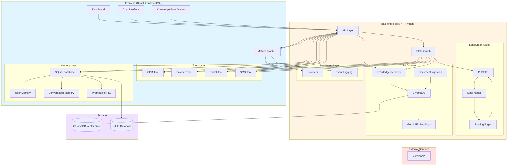
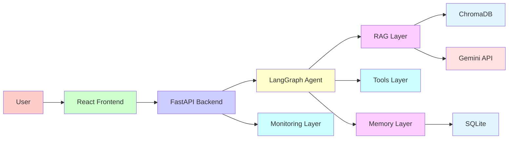
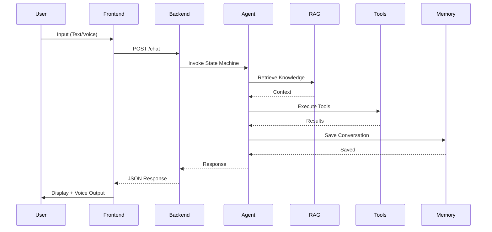
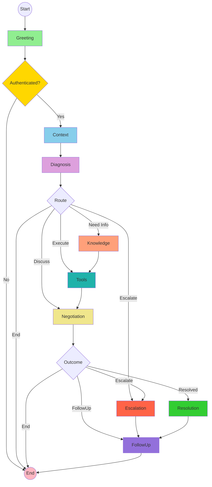

# CredResolve AI - Architecture Diagram

```mermaid
graph TB
    subgraph Frontend["Frontend (React + TailwindCSS)"]
        Dashboard[Dashboard]
        Chat[Chat Interface]
        Memory[Memory Viewer]
        Metrics[Metrics Viewer]
        Knowledge[Knowledge Base Viewer]
        Tools[Tool Logs Viewer]
    end
    
    subgraph Backend["Backend (FastAPI + Python)"]
        API[API Layer]
        
        subgraph Agent["LangGraph Agent"]
            Graph[State Graph]
            States[11 States]
            Nodes[State Nodes]
            Edges[Routing Edges]
        end
        
        subgraph RAG["RAG Layer"]
            Chroma[ChromaDB]
            Embeddings[Gemini Embeddings]
            Ingestion[Document Ingestion]
            Retriever[Knowledge Retriever]
        end
        
        subgraph Tools["Tools Layer"]
            CRM[CRM Tool]
            Payment[Payment Tool]
            Ticket[Ticket Tool]
            SMS[SMS Tool]
        end
        
        subgraph Memory["Memory Layer"]
            SQLite[SQLite Database]
            UserMem[User Memory]
            ConvMem[Conversation Memory]
            Promises[Promises to Pay]
        end
        
        subgraph Monitoring["Monitoring Layer"]
            Metrics[Metrics Tracker]
            Counters[Counters]
            Events[Event Logging]
        end
    end
    
    subgraph Storage["Storage"]
        ChromaDB[(ChromaDB Vector Store)]
        SQLiteDB[(SQLite Database)]
    end
    
    subgraph External["External Services"]
        Gemini[Gemini API]
    end
    
    Dashboard --> API
    Chat --> API
    Memory --> API
    Metrics --> API
    Knowledge --> API
    Tools --> API
    
    API --> Graph
    API --> Metrics
    API --> SQLite
    API --> Retriever
    API --> CRM
    API --> Payment
    API --> Ticket
    API --> SMS
    
    Graph --> States
    States --> Nodes
    Nodes --> Edges
    Edges --> States
    
    Graph --> Retriever
    Graph --> CRM
    Graph --> Payment
    Graph --> Ticket
    Graph --> SMS
    Graph --> SQLite
    
    Retriever --> Chroma
    Chroma --> Embeddings
    Ingestion --> Chroma
    
    SQLite --> UserMem
    SQLite --> ConvMem
    SQLite --> Promises
    
    Metrics --> Counters
    Metrics --> Events
    
    Embeddings --> Gemini
    Chroma --> ChromaDB
    SQLite --> SQLiteDB
    
    style Frontend fill:#e1f5ff
    style Backend fill:#fff4e1
    style Storage fill:#f0e1ff
    style External fill:#ffe1e1
```

## Component Relationships

```mermaid
graph LR
    A[User] --> B[React Frontend]
    B --> C[FastAPI Backend]
    C --> D[LangGraph Agent]
    D --> E[RAG Layer]
    D --> F[Tools Layer]
    D --> G[Memory Layer]
    C --> H[Monitoring Layer]
    E --> I[ChromaDB]
    G --> J[SQLite]
    E --> K[Gemini API]
    
    style A fill:#ffcccc
    style B fill:#ccffcc
    style C fill:#ccccff
    style D fill:#ffffcc
    style E fill:#ffccff
    style F fill:#ccffff
    style G fill:#ffccff
    style H fill:#ccffff
    style I fill:#e1f5ff
    style J fill:#e1f5ff
    style K fill:#ffe1e1
```

## Data Flow Diagram

```mermaid
sequenceDiagram
    participant U as User
    participant F as Frontend
    participant B as Backend
    participant A as Agent
    participant R as RAG
    participant T as Tools
    participant M as Memory
    
    U->>F: Input (Text/Voice)
    F->>B: POST /chat
    B->>A: Invoke State Machine
    A->>R: Retrieve Knowledge
    R-->>A: Context
    A->>T: Execute Tools
    T-->>A: Results
    A->>M: Save Conversation
    M-->>A: Saved
    A-->>B: Response
    B-->>F: JSON Response
    F->>U: Display + Voice Output
```

## State Machine Flow

```mermaid
graph TD
    Start((Start)) --> Greeting
    Greeting --> Auth{Authenticated?}
    Auth -->|Yes| Context
    Auth -->|No| End
    
    Context --> Diagnosis
    Diagnosis --> Route{Route}
    
    Route -->|Need Info| Knowledge
    Route -->|Execute| Tools
    Route -->|Discuss| Negotiation
    Route -->|Escalate| Escalation
    Route -->|End| End
    
    Knowledge --> Tools
    Tools --> Negotiation
    
    Negotiation --> Outcome{Outcome}
    Outcome -->|Resolved| Resolution
    Outcome -->|Escalate| Escalation
    Outcome -->|FollowUp| FollowUp
    Outcome -->|End| End
    
    Escalation --> FollowUp
    Resolution --> FollowUp
    
    FollowUp --> End
    End((End))
    
    style Greeting fill:#90EE90
    style Auth fill:#FFD700
    style Context fill:#87CEEB
    style Diagnosis fill:#DDA0DD
    style Knowledge fill:#FFA07A
    style Tools fill:#20B2AA
    style Negotiation fill:#F0E68C
    style Escalation fill:#FF6347
    style Resolution fill:#32CD32
    style FollowUp fill:#9370DB
    style End fill:#FFB6C1
```
