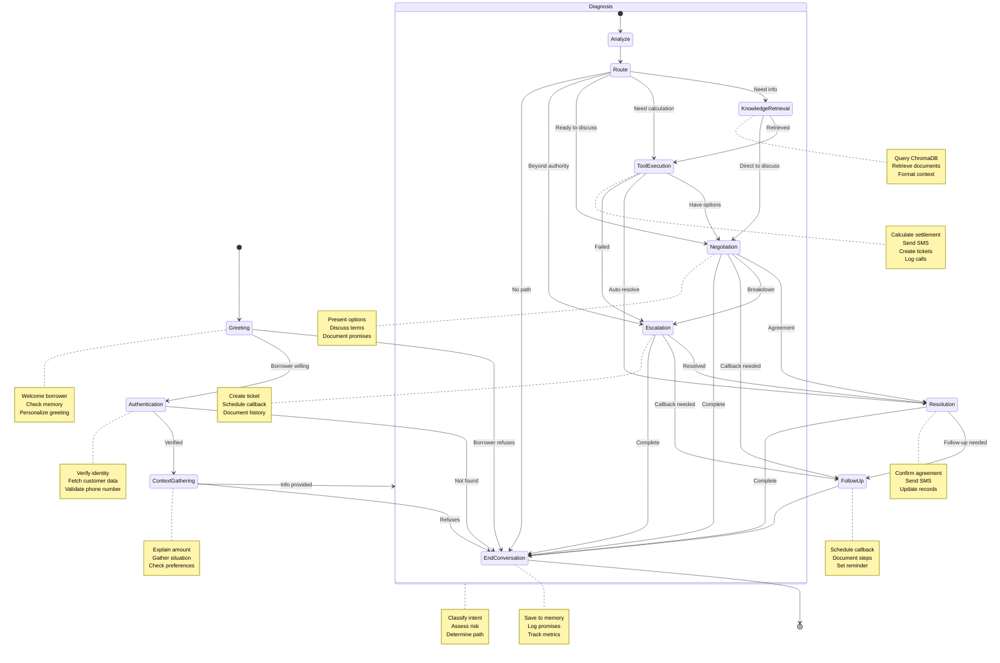
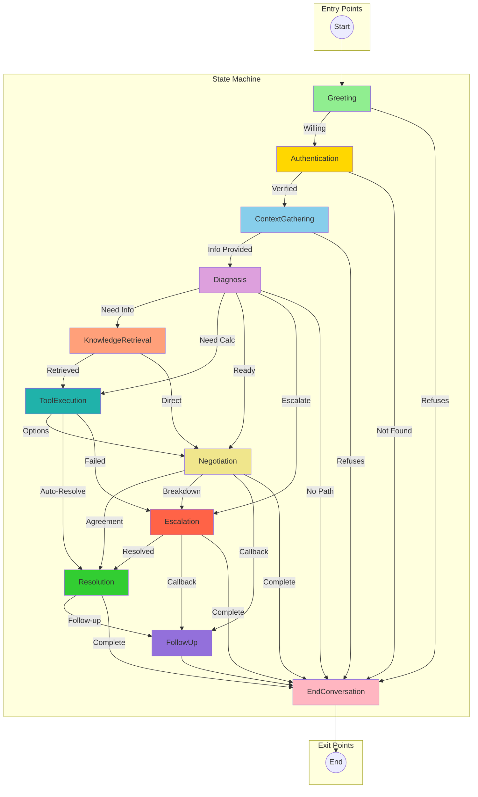
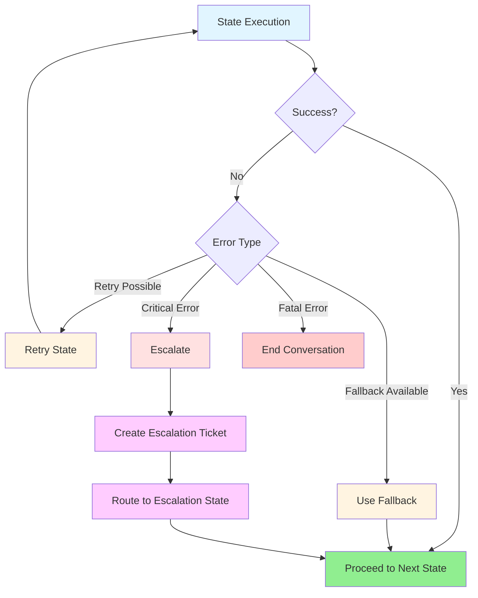
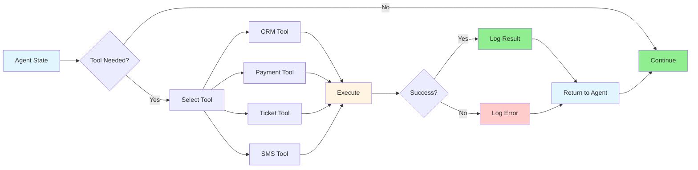
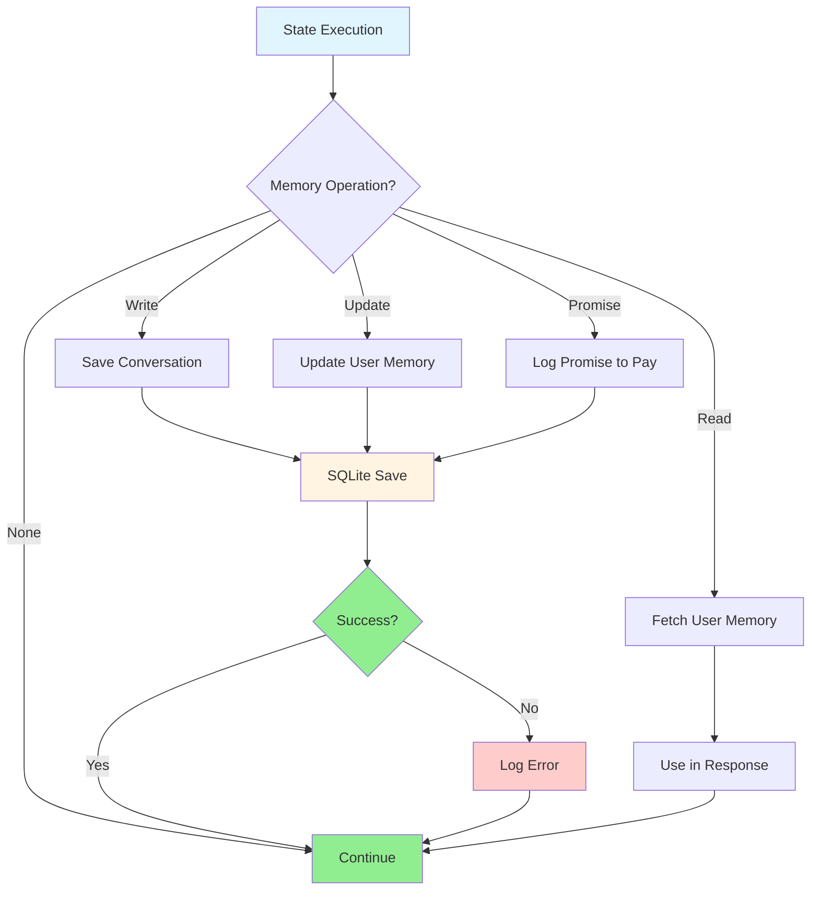

# CredResolve AI - State Machine Diagram

## Complete State Machine Flow

```mermaid
stateDiagram-v2
    [*] --> Greeting
    
    Greeting --> Authentication: Borrower willing
    Greeting --> EndConversation: Borrower refuses
    
    Authentication --> ContextGathering: Verified
    Authentication --> EndConversation: Not found
    
    ContextGathering --> Diagnosis: Info provided
    ContextGathering --> EndConversation: Refuses
    
    state Diagnosis {
        [*] --> Analyze
        Analyze --> Route
        
        Route --> KnowledgeRetrieval: Need info
        Route --> ToolExecution: Need calculation
        Route --> Negotiation: Ready to discuss
        Route --> Escalation: Beyond authority
        Route --> EndConversation: No path
    }
    
    KnowledgeRetrieval --> ToolExecution: Retrieved
    KnowledgeRetrieval --> Negotiation: Direct to discuss
    
    ToolExecution --> Negotiation: Have options
    ToolExecution --> Resolution: Auto-resolve
    ToolExecution --> Escalation: Failed
    
    Negotiation --> Resolution: Agreement
    Negotiation --> Escalation: Breakdown
    Negotiation --> FollowUp: Callback needed
    Negotiation --> EndConversation: Complete
    
    Escalation --> Resolution: Resolved
    Escalation --> FollowUp: Callback needed
    Escalation --> EndConversation: Complete
    
    Resolution --> FollowUp: Follow-up needed
    Resolution --> EndConversation: Complete
    
    FollowUp --> EndConversation
    
    EndConversation --> [*]
    
    note right of Greeting
        Welcome borrower
        Check memory
        Personalize greeting
    end note
    
    note right of Authentication
        Verify identity
        Fetch customer data
        Validate phone number
    end note
    
    note right of ContextGathering
        Explain amount
        Gather situation
        Check preferences
    end note
    
    note right of Diagnosis
        Classify intent
        Assess risk
        Determine path
    end note
    
    note right of KnowledgeRetrieval
        Query ChromaDB
        Retrieve documents
        Format context
    end note
    
    note right of ToolExecution
        Calculate settlement
        Send SMS
        Create tickets
        Log calls
    end note
    
    note right of Negotiation
        Present options
        Discuss terms
        Document promises
    end note
    
    note right of Escalation
        Create ticket
        Schedule callback
        Document history
    end note
    
    note right of Resolution
        Confirm agreement
        Send SMS
        Update records
    end note
    
    note right of FollowUp
        Schedule callback
        Document steps
        Set reminder
    end note
    
    note right of EndConversation
        Save to memory
        Log promises
        Track metrics
    end note
```

## State Transition Details

```mermaid
graph TB
    subgraph Entry["Entry Points"]
        Start((Start))
    end
    
    subgraph States["State Machine"]
        Greeting[Greeting]
        Auth[Authentication]
        Context[ContextGathering]
        Diag[Diagnosis]
        Knowledge[KnowledgeRetrieval]
        Tools[ToolExecution]
        Negot[Negotiation]
        Esc[Escalation]
        Res[Resolution]
        Follow[FollowUp]
        End[EndConversation]
    end
    
    subgraph Exit["Exit Points"]
        Done((End))
    end
    
    Start --> Greeting
    
    Greeting -->|Willing| Auth
    Greeting -->|Refuses| End
    
    Auth -->|Verified| Context
    Auth -->|Not Found| End
    
    Context -->|Info Provided| Diag
    Context -->|Refuses| End
    
    Diag -->|Need Info| Knowledge
    Diag -->|Need Calc| Tools
    Diag -->|Ready| Negot
    Diag -->|Escalate| Esc
    Diag -->|No Path| End
    
    Knowledge -->|Retrieved| Tools
    Knowledge -->|Direct| Negot
    
    Tools -->|Options| Negot
    Tools -->|Auto-Resolve| Res
    Tools -->|Failed| Esc
    
    Negot -->|Agreement| Res
    Negot -->|Breakdown| Esc
    Negot -->|Callback| Follow
    Negot -->|Complete| End
    
    Esc -->|Resolved| Res
    Esc -->|Callback| Follow
    Esc -->|Complete| End
    
    Res -->|Follow-up| Follow
    Res -->|Complete| End
    
    Follow --> End
    End --> Done
    
    style Greeting fill:#90EE90
    style Auth fill:#FFD700
    style Context fill:#87CEEB
    style Diag fill:#DDA0DD
    style Knowledge fill:#FFA07A
    style Tools fill:#20B2AA
    style Negot fill:#F0E68C
    style Esc fill:#FF6347
    style Res fill:#32CD32
    style Follow fill:#9370DB
    style End fill:#FFB6C1
```

## Error Recovery Flow

```mermaid
graph TD
    A[State Execution] --> B{Success?}
    B -->|Yes| C[Proceed to Next State]
    B -->|No| D{Error Type}
    
    D -->|Retry Possible| E[Retry State]
    D -->|Fallback Available| F[Use Fallback]
    D -->|Critical Error| G[Escalate]
    D -->|Fatal Error| H[End Conversation]
    
    E --> A
    F --> C
    G --> I[Create Escalation Ticket]
    I --> J[Route to Escalation State]
    J --> C
    
    style A fill:#e1f5ff
    style C fill:#90EE90
    style E fill:#fff4e1
    style F fill:#fff4e1
    style G fill:#ffe1e1
    style H fill:#ffcccc
    style I fill:#ffccff
    style J fill:#ffccff
```

## Tool Integration Flow

```mermaid
graph LR
    A[Agent State] --> B{Tool Needed?}
    B -->|Yes| C[Select Tool]
    B -->|No| D[Continue]
    
    C --> E[CRM Tool]
    C --> F[Payment Tool]
    C --> G[Ticket Tool]
    C --> H[SMS Tool]
    
    E --> I[Execute]
    F --> I
    G --> I
    H --> I
    
    I --> J{Success?}
    J -->|Yes| K[Log Result]
    J -->|No| L[Log Error]
    
    K --> M[Return to Agent]
    L --> M
    M --> D
    
    style A fill:#e1f5ff
    style D fill:#90EE90
    style I fill:#fff4e1
    style K fill:#90EE90
    style L fill:#ffcccc
    style M fill:#e1f5ff
```

## Memory Integration Flow

```mermaid
graph TD
    A[State Execution] --> B{Memory Operation?}
    B -->|Read| C[Fetch User Memory]
    B -->|Write| D[Save Conversation]
    B -->|Update| E[Update User Memory]
    B -->|Promise| F[Log Promise to Pay]
    B -->|None| G[Continue]
    
    C --> H[Use in Response]
    D --> I[SQLite Save]
    E --> I
    F --> I
    
    I --> J{Success?}
    J -->|Yes| G
    J -->|No| K[Log Error]
    
    K --> G
    H --> G
    
    style A fill:#e1f5ff
    style G fill:#90EE90
    style I fill:#fff4e1
    style J fill:#90EE90
    style K fill:#ffcccc
```
